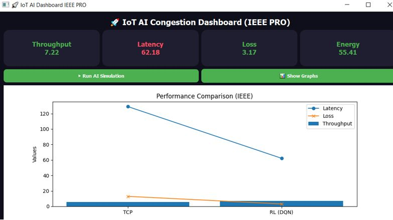
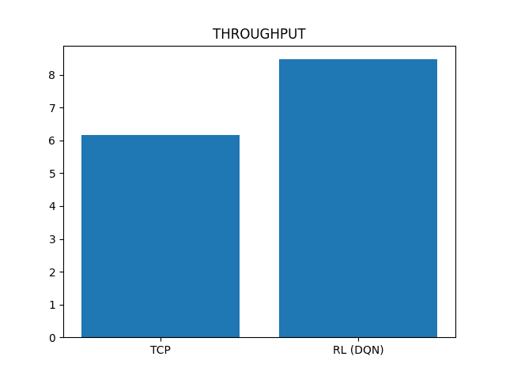
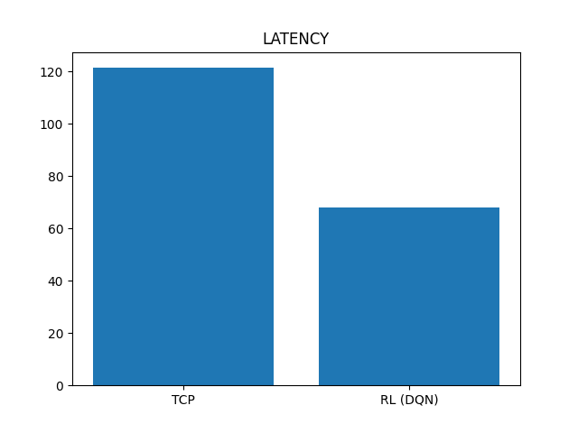
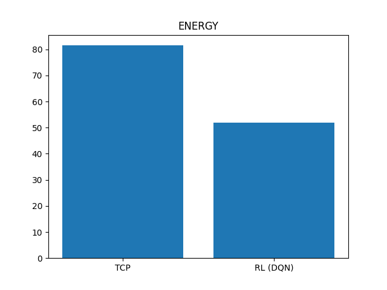
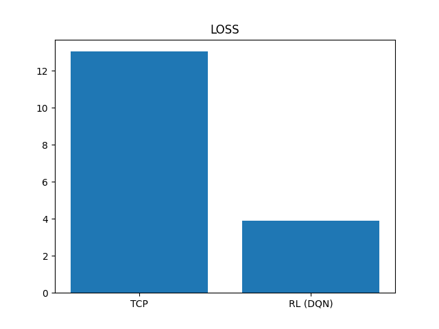
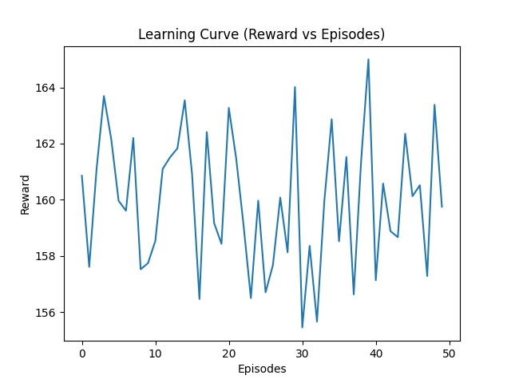

# 🚀 IoT-RL Congestion Optimizer  
### 🧠 AI-Powered Network Intelligence for Smart IoT Systems  


## 🌍 Vision  

Transforming IoT networks into **self-optimizing intelligent systems** using Artificial Intelligence.  

IoT-RL Congestion Optimizer leverages **Reinforcement Learning (DQN)** to dynamically manage network congestion, enabling **faster, smarter, and more energy-efficient communication**.

## 💡 Problem  

Traditional network protocols like TCP are:

❌ Reactive (not predictive)  
❌ Inefficient in dynamic IoT environments  
❌ Energy-consuming  
❌ Not scalable for billions of IoT devices  

👉 Result: **High latency, packet loss, and network congestion**

## ⚡ Solution  

An AI-driven congestion control platform that:

- 🧠 Learns network behavior in real-time  
- ⚙️ Optimizes data flow dynamically  
- 📉 Reduces latency and packet loss  
- ⚡ Minimizes energy consumption  

## 📊 Key Results (Simulation)

<div style="overflow-x:auto;">

<table style="
    width:100%;
    border-collapse: collapse;
    font-family: Arial;
    background-color:#1e1e2f;
    color:white;
    border-radius:10px;
">

<thead>
<tr style="background-color:#4CAF50;">
    <th style="padding:12px;">Metric</th>
    <th style="padding:12px;">Improvement</th>
</tr>
</thead>

<tbody>

<tr>
    <td style="padding:12px;">🚀 Throughput</td>
    <td style="padding:12px; color:#00ffcc;"><b>+35–40%</b></td>
</tr>

<tr>
    <td style="padding:12px;">⏱️ Latency</td>
    <td style="padding:12px; color:#ffcc00;"><b>−40–45%</b></td>
</tr>

<tr>
    <td style="padding:12px;">📉 Packet Loss</td>
    <td style="padding:12px; color:#ff4c60;"><b>−70%</b></td>
</tr>

<tr>
    <td style="padding:12px;">⚡ Energy</td>
    <td style="padding:12px; color:#4CAF50;"><b>−35–40%</b></td>
</tr>

</tbody>
</table>

</div>

## 📸 Dashboard Preview    
<div style="text-align:center; margin-top:20px;">

<h3 style="color:#4CAF50;">🖥️ KPI Dashboard</h3>

<div style="
    display:inline-block;
    background: linear-gradient(135deg, #1e1e2f, #2d2d44);
    padding:15px;
    border-radius:15px;
    box-shadow: 0px 4px 20px rgba(0,0,0,0.5);
">



</div>

<p style="color:#aaa; margin-top:10px;">
Real-time AI-powered dashboard showing network performance metrics
</p>

</div>

## 📊 Results Visualization  

### 🚀 Throughput


### ⏱️ Latency


### ⚡ Energy


### 📉 Packet Loss


### 🧠 Learning Curve


## 🖥️ Product Features  

- 📊 Real-time AI Dashboard  
- 🧠 Deep Reinforcement Learning (DQN)  
- 📈 Performance analytics  
- 📡 IoT network simulation  
- 📄 Export results (CSV + figures)  

## 🏗️ Architecture  
IoT Devices → Data Flow → RL Agent (DQN) → Decision Engine → Network Optimization → Dashboard

---

## 🛠️ Tech Stack  

- 🐍 Python 3.11  
- 🧠 PyTorch  
- 📊 Matplotlib  
- ⚡ NumPy  
- 🖥️ PyQt5  

---

## ▶️ Quick Start  

```bash
git clone https://github.com/your-username/iot-rl-congestion.git
cd iot-rl-congestion

python -m venv venv
venv\Scripts\activate

pip install torch torchvision torchaudio --index-url https://download.pytorch.org/whl/cpu
pip install PyQt5 matplotlib numpy

python main.py
🎯 Use Cases
🏙️ Smart Cities
🚦 Intelligent Transport
🏥 Healthcare IoT
🏭 Industrial IoT
🌐 Smart Networks
🧠 Innovation

✔️ AI-based congestion prediction
✔️ Adaptive optimization
✔️ Energy-aware communication
✔️ Scalable architecture

📈 Business Potential
📡 Telecom optimization
🌍 Smart infrastructure
🧠 AI SaaS platform
🚀 Cloud deployment
👤 Founder

Maloani Saidi Georges
PhD Candidate in Computer Science
CEO, MS Solutions Lab

📧 georgesmaloanis@gmail.com

🤝 Collaboration

We are open to:

🤝 Research collaborations
💼 Industry partnerships
💰 Investment opportunities
⭐ Support

If you like this project:

👉 ⭐ Star
👉 🔁 Share
👉 💬 Contribute
